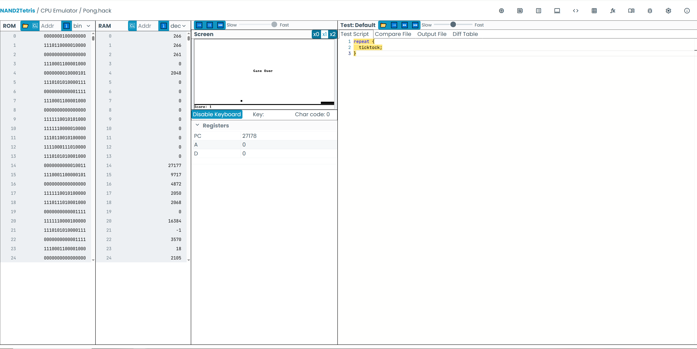

## 第 6 章：Hack 汇编器（Assembler）

本目录是根据《计算机系统要素（Nand2Tetris）》第 6 章实现的 **Hack 汇编器**。  
它可以把 `.asm` 汇编程序转换为 Hack 机器可以直接执行的二进制 `.hack` 代码。

---

### 功能概述

- **支持的指令类型**
  - **A 指令**：`@value` / `@symbol`  
    - 数字形式会被直接转成 16 位二进制（最高位为 0）。  
    - 符号形式会先在符号表中解析为地址，再转换为二进制。
  - **C 指令**：`dest=comp;jump` 三部分任意省略组合  
    - 通过内置的 `comp_table`、`dest_table`、`jump_table` 翻译成机器码（最高 3 位为 `111`）。
- **伪指令（标签）处理**
  - 形如 `(LOOP)` 的行会被当作 **标签定义**，本身不生成机器码，只记录后面指令的地址。
- **符号表支持**
  - 预定义符号：`SP`、`LCL`、`ARG`、`THIS`、`THAT`、`SCREEN`、`KBD`。
  - 预定义寄存器：`R0` ~ `R15`。
  - 标签（伪指令）：使用 `()` 声明，例如 `(LOOP)`。
  - 变量：第一次在 A 指令中以 `@symbol` 形式出现、且不是数字和已有符号时，从地址 16 开始依次分配。
- **注释与空行**
  - 支持行内 `//` 注释：会截断后面的内容。
  - 自动忽略空行和只包含空白字符的行。

---

### 代码结构

- `parser.py`：主程序，完成从 `.asm` 到 `.hack` 的整个转换流程：
  - `extract_instructions`：读取源文件，去除注释和空行，得到纯净的汇编指令列表。
  - `extract_pseudo_instructions`：提取伪指令（`(LABEL)`），同时得到只包含真实指令的列表。
  - `build_symbol_table`：构建并填充符号表（预定义符号、标签、变量）。
  - `replace_symbols`：把所有符号形式的 A 指令替换成纯数字地址（`@number`）。
  - `parse_a_instruction`：把 A 指令转换为 16 位二进制机器码。
  - `translate_c_instruction` / `parse_c_instruction`：把 C 指令翻译为二进制机器码。
  - `hack_assembler`：高层封装，串联上述所有步骤，并负责写出目标 `.hack` 文件。

---

### 使用方法

在项目根目录下，使用 Python 运行：

```bash
python chapter_6/parser.py <输入文件.asm> -o <输出文件.hack>
```

示例（以书中的 `Mult.asm` 为例）：

```bash
python chapter_6/parser.py chapter_6/Mult.asm -o chapter_6/Mult.hack
```

如果不指定 `-o` / `--output_file`，程序会自动把输入文件名的后缀从 `.asm` 改为 `.hack`：

```bash
python chapter_6/parser.py chapter_6/Mult.asm
# 将生成：chapter_6/Mult.hack
```

---

### 关键实现思路回顾

- **两遍扫描思想（逻辑上）**
  1. 第一遍：通过 `extract_pseudo_instructions` 和 `build_symbol_table`  
     - 统计并记录所有标签对应的指令地址。  
     - 同时确定所有变量需要的内存地址（从 16 开始分配）。
  2. 第二遍：通过 `replace_symbols` 和后续 `parse_*`  
     - 把符号全部替换为数字地址，再逐条翻译成机器码。
- **指令解析细节**
  - A 指令：保证 `@` 后面是数字，否则会抛出异常（说明符号没有被正确替换）。  
  - C 指令：按 `dest=comp;jump` 的格式拆分：
    - 先按 `;` 分出 `jump`；  
    - 再按 `=` 分出 `dest` 和 `comp`；  
    - 最后查表得到 `comp_bits`、`dest_bits`、`jump_bits`。

---

### 测试

- 使用 `python chapter_6/parser.py chapter_6\pong\Pong.asm -o chapter_6/Pong.hack` 对 Pong.asm 进行翻译
- 将编译结果 `Pong.hack` 加载到官方的提供的 [网页CPU模拟器](https://nand2tetris.github.io/web-ide/cpu)，点击 Run 按钮，显示效果如下


---

### 总结

这一章的实现从零开始手写了一个完整的 Hack 汇编器，  
通过 **解析、符号表、两遍扫描、指令编码** 等步骤，  
把“人类可读的汇编程序”成功翻译为“机器可执行的二进制代码”，
非常适合之后在做虚拟机、编译器等章节时进行对比和复习。


